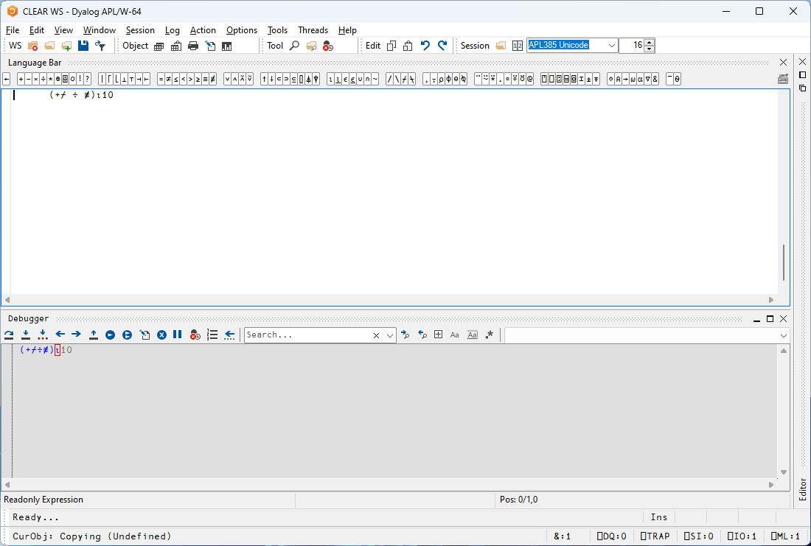
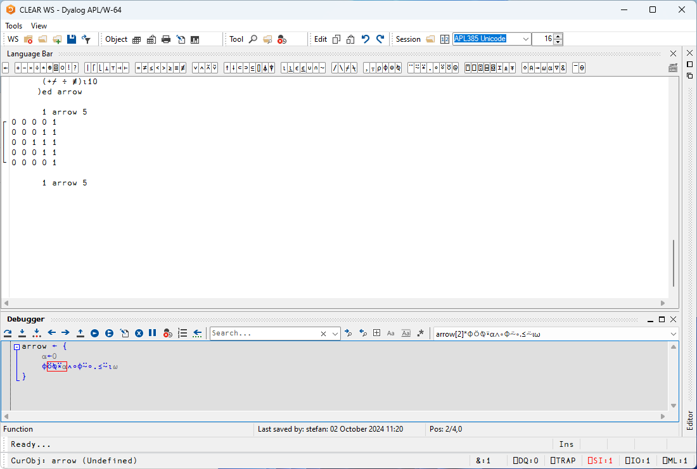
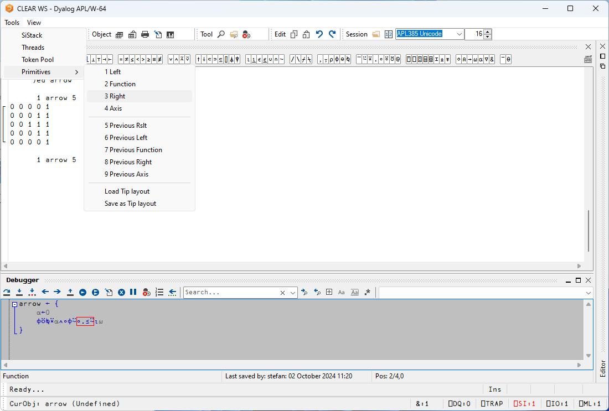
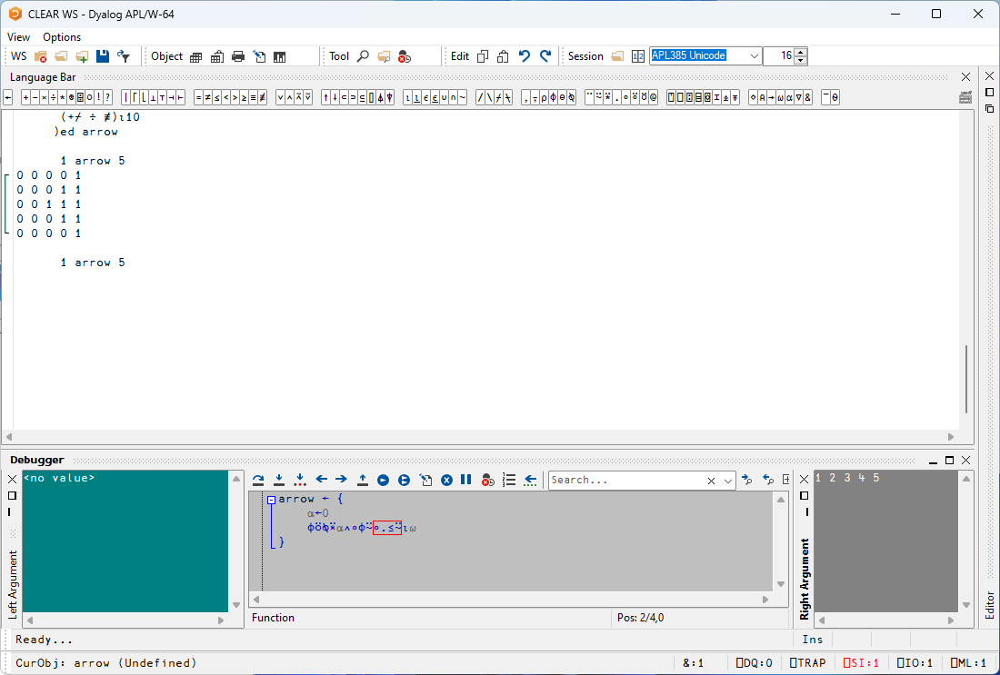
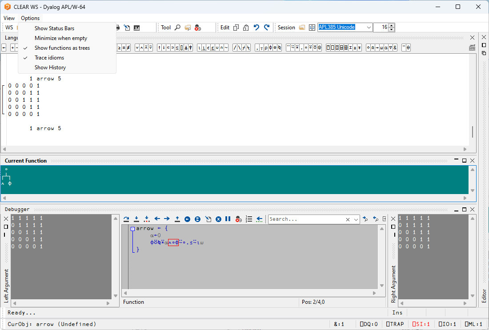

# Overview

Token by token tracing (TBT) is an extension to the tracer that allows the developer to step through the execution of individual primitives of expressions, examining intermediate results and left and right arguments of sub-expressions. This has been demoed by John Daintree over several user meetings, including:

* [Dyalog 22](https://dyalog.tv/Dyalog22/?v=b2at0Sa8v3E)
* [Dyalog 23](https://dyalog.tv/Dyalog23/?v=CohsPaCIh4s)

TBT is now in the version 20 nightly builds, and the purpose of this document is to provide a "getting started" guide to how you use it. It's a powerful addition to the developer's toolbox: it allows for the introspection of complex expressions typed directly into the session, and can be used in conjunction with the traditional tracing mode to skip over lines you're not interested in, and dive into primitives level for the interesting bits. 

## Getting started

There are two primary means of starting a TBT session. Firstly, there is a new key-combo added, currently <kbd>shift</kbd>+<kbd>alt</kbd>+<kbd>enter</kbd> (analogous to the <kbd>control</kbd>+<kbd>enter</kbd> used to start a "normal" trace). This key-combo can be used directly in the session. In the session, enter

```apl
(+/÷≢)⍳10
```
and hit <kbd>shift</kbd>+<kbd>alt</kbd>+<kbd>enter</kbd>. You should see:



The little red box surrounding the `⍳` is showing the next primitive to be executed. Keep hitting <kbd>shift</kbd>+<kbd>alt</kbd>+<kbd>enter</kbd> a few times to see how the execution progresses through the tacit expression. 

The other way of instigating a TBT session is to use the new "next token" symbol in the tracer's toolbar, showing as a downward arrow over three dots. Let's write a dfn to try this out:

```apl
Arrow ← { ⍝ Draw an arrow head of size ⍵, direction given by ⍺
    ⍺←0
    ⌽⍤⍉⍣⍺∧∘⌽⍨∘.≤⍨⍳⍵
} 
```

```
      1 Arrow 5
┌→────────┐
↓0 0 0 0 1│
│0 0 0 1 1│
│0 0 1 1 1│
│0 0 0 1 1│
│0 0 0 0 1│
└~────────┘
```

Trace into the expression `1 Arrow 5` with <kbd>control</kbd>+<kbd>enter</kbd>. Execute the first line by hitting <kbd>enter</kbd> (or clicking the Execute Line symbol in the toolbar) like you normally would. On the next line, you can now use the TBT icon to trace through token by token (or use <kbd>
shift</kbd>+<kbd>alt</kbd>+<kbd>enter</kbd>). 



In other words, the TBT "next token" icon is always present in the tracer. The new key-combo lets you open a tracer on an expression typed directly in the session that previously could not be traced into. 

## Advanced TBT

So far, we've been able to follow the execution _flow_, which is particularly useful when dealing with tacit expressions. The TBT system can help us further by also showing intermediate left and right arguments and earlier results. These aspects of the tracer UI are disabled by default, but can be picked up from the _Tools > Primitives__ menu. 



Note that there are close to a dozen entries here -- we won't be covering them all, and in all likelihood, you will probably not need several of them very often.

The key ones are _Left_ and _Right_, representing the left, and right argument about to be passed to the function currently highlighted by the red box. Enable the _Left_ and _Right_ UI elements by selecting them from the menu, and place them as you see fit. Even if you're not a fan of docked windows, it works well visually of having the argument windows docked in the tracer. Step through a few tokens, and observe how the intermediate left, and right arguments change as the execution progresses. 



The next UI element you may want to consider is _Function_, showing the current function. At first blush, this may seem redundant, as it's already visible by the red box. However, it can be set to render as a tree (like what `]box on -t=tree` does), which occasionally can prove useful when dealing with complex tacit expressions.



There are several other UI elements available to you, including those that give you a view of the _previous_ function's arguments and results. Explore those as and when you feel that this is something you need. There is also a UI element showing the current bracket axis.

An interesting optional aspect from the _Options_ menu is _Show History_, which, when enabled, also draw boxes in yellow, showing which bits of an expression have already been executed. If the utility of that isn't immediately clear, consider a complex tacit expression. The execution flow tends to "jump" around (one of the reasons that some people find tacit hard to read). With _Show History_ enabled, you can see wich bits of a tacit expression have been executed. Note that _Show History_ currently isn't fully completed, and may potentially be dropped from version 20. Do experiment with it, and see what you think.


